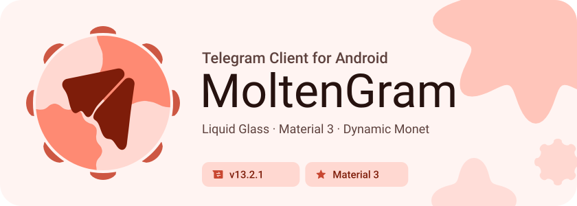
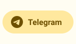
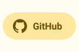

<div align="center">

<!-- Hero Header Banner -->
<picture>
  <source media="(prefers-color-scheme: dark)" srcset="assets/hero-dark-v2.svg">
  
</picture>

<!-- Social & Communities Link Strip -->
<picture><source media="(prefers-color-scheme: dark)" srcset="assets/social-l-dark-v2.svg"></picture><a href="https://t.me/MoltenGram"><picture><source media="(prefers-color-scheme: dark)" srcset="assets/social-1-dark-v2.svg"></picture></a><a href="https://github.com/MoltenSt4r/MoltenGram"><picture><source media="(prefers-color-scheme: dark)" srcset="assets/social-2-dark-v2.svg"></picture></a><picture><source media="(prefers-color-scheme: dark)" srcset="assets/social-r-dark-v2.svg"></picture>

<!-- Action Buttons -->
<p align="center">
  <a href="https://canary.moltenstar.space"><picture><source media="(prefers-color-scheme: dark)" srcset="assets/button-1-dark.svg"></picture></a>
  &nbsp;&nbsp;
  <a href="https://github.com/MoltenSt4r"><picture><source media="(prefers-color-scheme: dark)" srcset="assets/button-2-dark.svg"></picture></a>
</p>

<!-- Key Features Card -->
<picture>
  <source media="(prefers-color-scheme: dark)" srcset="assets/about-dark-v2.svg">
  
</picture>

<br>

<!-- Rounded Material 3 Pill Action Strip -->
<p align="center">
  <a href="https://canary.moltenstar.space/download/canary"><picture><source media="(prefers-color-scheme: dark)" srcset="assets/pill-canary-dark.svg?v=canary2"></picture></a>
  &nbsp;
  <a href="https://t.me/MoltenGram"><picture><source media="(prefers-color-scheme: dark)" srcset="assets/pill-tg-dark.svg?v=canary2"></picture></a>
  &nbsp;
  <a href="https://t.me/MoltenGramBot"><picture><source media="(prefers-color-scheme: dark)" srcset="assets/pill-support-dark.svg?v=canary2"></picture></a>
</p>

<br>

<!-- What's New in v13.2.1 «Glintvein» Card -->
<picture>
  <source media="(prefers-color-scheme: dark)" srcset="assets/whatsnew-dark.svg?v=canary2">
  
</picture>

<br>

<!-- Download & Channels Card -->
<a href="https://canary.moltenstar.space/download/canary">
  <picture>
    <source media="(prefers-color-scheme: dark)" srcset="assets/download-dark.svg?v=canary2">
    
  </picture>
</a>

<br>

<!-- Tech Stack & Build Card -->
<picture>
  <source media="(prefers-color-scheme: dark)" srcset="assets/stack-dark.svg">
  
</picture>

<br>

<picture>
  <source media="(prefers-color-scheme: dark)" srcset="assets/build-dark.svg?v=canary2">
  
</picture>

<details>
<summary><b>🛠️ Build from Source &amp; F-Droid Fingerprint</b></summary>

```bash
git clone --recursive https://github.com/MoltenSt4r/MoltenGram.git
cd MoltenGram
echo "sdk.dir=/path/to/Android/Sdk" > local.properties
./gradlew assembleRelease
```

**F-Droid Repo:** `https://moltenst4r.github.io/MoltenGram/fdroid/repo`  
**SHA-256 Fingerprint:** `4B4EFFEE9D4CCBCB75DC3BF2E2A21655F2F35747B2D95FCF836E186FCE9D5030`

</details>

<br>

<!-- Credits & License Card -->
<picture>
  <source media="(prefers-color-scheme: dark)" srcset="assets/credit-dark.svg?v=canary2">
  
</picture>

<br>

<!-- Footer Wave -->
<picture>
  <source media="(prefers-color-scheme: dark)" srcset="assets/wave-dark-v2.svg">
  
</picture>

</div>
